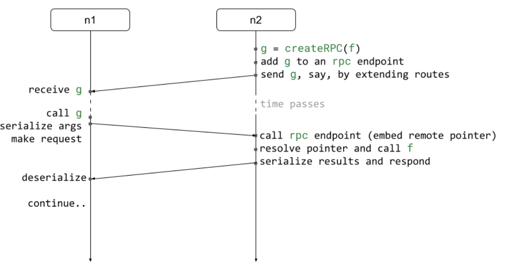
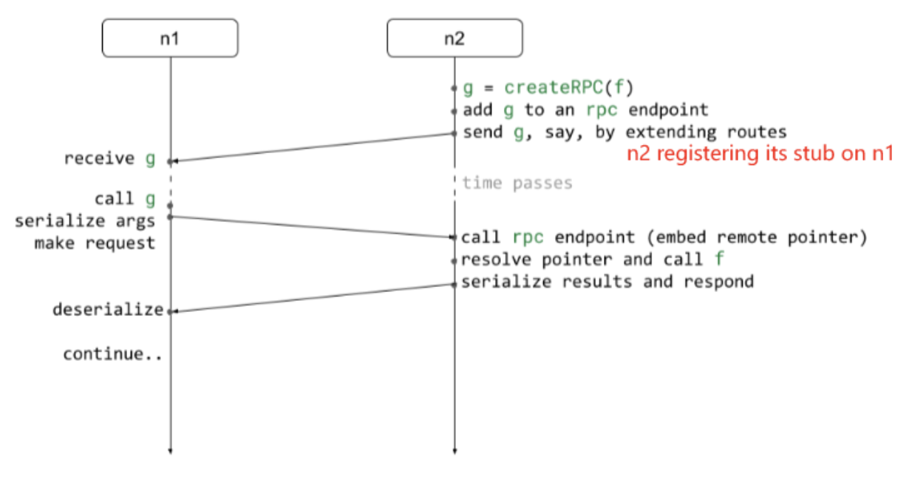

M2: Actors & Remote Procedure Calls

>Collaboration: Individual milestone\
>Completion: About 10–12 hours\
>Deadline: Monday Feb. 19, 2024 (11:59PM ET), pending results of quiz 6\
>Latest handout version: CS1380:2024:M2\
>GitHub repo: https://github.com/brown-cs1380/m2

## Table of Contents
* [Background & Context](#background--context)
* [Per-Node Listener and Configuration](#per-node-listener-and-configuration)
* [Naming and Calling Conventions](#naming-and-calling-conventions)
* [The Core Service Library](#the-core-service-library)
* [Error Handling](#error-handling)
* [Remote Procedure Calls](#remote-procedure-calls)
* [Reflections & The Way Forward](#reflections--the-way-forward)
* [Tips & Submission](#tips--submission)
* [Implementation Checklist](#implementation-checklist)
* [FAQ](#faq)
* [Feedback](#feedback)


## Background & Context

A distributed environment can be viewed as a collection of nodes collectively providing one or more services. A typical distributed environment today might feature a closed set of primitives supporting these services. These primitives are often baked into the system, at times allowing only for some form of configurability through parameters. In this milestone we will explore an alternative approach — dynamic sets of services that support runtime extensibility.


In our environment, each node maintains service bindings, handles communication with other nodes, and executes incoming code. Its core is a routing function: given an incoming message as an argument, it routes that message to the service responsible for handling it. Messages can arrive from services running on the same node, or from services running on other nodes. A message in our setting may encode a multitude of value types such as primitive values, functions, and objects. Messages that encode functions are particularly important, because they provide the necessary means for extensibility: shipping services among nodes at runtime.


By registering additional entries in the routing core we can extend the functionality of a node. Built-in services may also be loaded and instantiated dynamically, often by pulling their functionality from peer nodes. At its core, each node provides only the essential infrastructure for building an extensible service architecture; in the next milestones we will see how to lift this extensible service architecture into a unified distributed substrate.


The following online resources might be useful for this milestone:

- Node's [http](https://nodejs.org/dist/latest-v20.x/docs/api/http.html), [url](https://nodejs.org/dist/latest-v20.x/docs/api/url.html), and [crypto](https://nodejs.org/dist/latest-v20.x/docs/api/crypto.html) libraries


## Per-Node Listener and Configuration

Each node combines two elements: (1) a listening server for receiving messages from the network, explained in this section; and (2) an extensible library of services, shown in the next section, each responsible for handling different messages.


**Node configuration.** At a minimum, the node configuration includes an IP address and a port. In the examples below, we assume two nodes — by default a node `n1`, which at times initiates interactions with a node `n2`. 

```js
let n1 = {ip: "127.0.0.1", port:"8080"};
let n2 = {ip: "127.0.0.1", port:"8081"};
```

A node can be configured upon startup either by providing as a parameter a serialized configuration object (in the general case, this object can include any [M1-supported ](https://docs.google.com/document/d/e/2PACX-1vSwf1NRh7D1iYxlqgnIPQT7pvCZEzbwoZ3dsRTnktxzJopuJSU2E2HB7_He-cVcOaDqWgTyYT18gjBJ/pub)deserialization value etc.) or by setting a global `config` object before importing the distribution library. The former is useful for passing a parameter when a node is spawned as a Unix process by running `./distribution.js` in the terminal; the latter is useful for when a node is launched by importing the `distribution.js` library. Here's an example of the former:

```sh
./distribution.js --config '{ "ip": "127.0.0.1", "port": 8080}'
```

**Node identifiers.** A node identifier (NID) is a sha256 hash of this object; and a short node identifier (SID) is the first 5 characters of this hash. Appropriate methods for calculating these are provided in `utils/id.js`. These IDs are helpful for uniquely identifying a node, and can be used to distinguish data storage locations as distinct local folders when multiple nodes are running on the same computer (e.g., a student laptop), useful for later milestones.


**Node listener.** For simplicity, the node listening server will be implemented by an HTTP server provided by the `http` library. Here's an example of such a server:

```js
let resolve = (req, res) => console.log("request", req);
let start = (srv) => console.log("running", n1);
http.createServer(resolve).listen(n1.port, n1.ip, start);
```

A few functions are important here. Function `resolve` takes a request and a response object, and populates the response object based on information from the request; it will need to _route_ the payload through the appropriate service using the `routes` service (explained below). Function `start` will be called after the HTTP server is up and running, and can be used to schedule the initiation of any stateful services — for example, services that send or receive configuration information via other nodes. It takes as parameter the server object itself — so that it has the ability to execute `srv.stop` when it needs to stop the HTTP server (say, to complete testing or to gracefully shut down a node.)


## Naming and Calling Conventions

A node contains a library of services, which are callable both from within a node and from other nodes. The structure of the library is `distribution.local[service][method]`. For example, `distribution.local.status.get() `points to the `get` _method_ of the `mem` _service_. The next section discusses a few services available by default on every node; implementing these services is the focus of this milestone. For brevity, we will be omitting the first two parts in the code snippets below — for example, we will be writing `status.get()`.


**Continuation methods.** Service methods are _asynchronous and continuation-passing_ — i.e., instead of returning a result directly, they take a continuation function that handles the result. This is true for _all_ services our system implements, which means all service methods take an optional callback as their last argument. (The callback is optional because a caller might not be interested in the return value, similar to how the return value of a direct call is not always assigned to a variable.). Here's an example continuation method `cb` used extensively in M2:

```js
let cb = (e, v) => e? console.error(e) : console.log(v);
```

The continuation function takes two arguments: an optional `Error` object and an optional result returned by the service. The reason it takes two arguments, instead of multiplexing these in a single slot, is to allow `Error`s to be a valid result of an operation. If the first argument to the continuation function is `null`, the second argument (be it an `Error`, a list of results, or anything else a service produces) is a valid result. Method `console.log` typically works as a quick-and-easy continuation for testing results, as it takes multiple arguments.


**Service arguments.** Moreover, the service methods implemented in this milestone will take up to two other optional parameters: (1) an optional _state_ value, i.e., any (serializable) language value, and (2) an optional _configuration_ object or string. (As explained in the previous paragraph, they also take an optional _continuation_ function, to be called with appropriate results when the operation completes.) Here is a simple example:

```js
status.get("nid", cb)
```

All parameters are optional: if no value is provided, your system _should pick an appropriate default value_ and proceed as expected. Since default values are service-specific, this kind of handling should be done inside each service. More details on some things you should keep in mind while implementing this logic are discussed in the [Error Handling](https://docs.google.com/document/d/1sP-b6Ls7YuaCVzBw-MOahoS0BoS4jZ2vHz3IjJSSwSk/edit#heading=h.djq1j49m1xh7) section later.


## The Core Service Library

The table below shows a core set of services that need to be implemented (and eventually be made available by the system to anyone importing or using `distribution.js`.):

| Service  | Description                                  | Methods      |
| -------- | -------------------------------------------- | ------------ |
| status   | Information about the current node           | `get`        |
| routes   | A mapping from names to functions (services) | `get`, `put` |
| comm     | A message communication interface            | `send`       |

**Service status.** The `status` service is responsible for maintaining some node-related information such as the node IP and port.

```js
status.get("nid", console.log);
status.get("sid", console.log);
```

At the very least, values should exist for the following values as first parameters: `nid` (returning the node ID), `sid` (returning the short ID), `ip` (returning the listening IP), `port` (returning the listening port), `counts` (returning a global message count — either have each service increment that counter when handling messages or have the server do it for all services). If the accessible property does not exist, it should invoke the provided continuation with appropriate `Error` arguments (see [above](https://docs.google.com/document/d/1sP-b6Ls7YuaCVzBw-MOahoS0BoS4jZ2vHz3IjJSSwSk/edit#heading=h.xdn4ysl1soma)).


**Service routes.** The `routes` service is responsible for maintaining a mapping from names to the objects responsible for handling operations. The reason this contains a bit more functionality than a map is to provide an interface for extensibility. 

```js
routes.get("status",(e, service) => service.get("nid", console.log));
routes.put(echoService, "echo", console.log);
```

As before, if the value about to be accessed does not exist, the service should invoke the provided continuation with appropriate `Error` arguments (see [above](https://docs.google.com/document/d/1sP-b6Ls7YuaCVzBw-MOahoS0BoS4jZ2vHz3IjJSSwSk/edit#heading=h.xdn4ysl1soma)).


**Service comm.** The `comm` service is responsible for `send`ing messages across nodes. It will prepare a message, serializing all arguments, and ship it to the `routes` service of the remote node, which will pass the message to the service appropriate for handling it. The first argument to `send` is the list of arguments to the method, the second argument is information about the remote service, and the third (optional) argument is the callback.

```js
remote = {node: n2, service: 'status', method: 'get'};
message = ['counts']; // list of arguments to service (status)
comm.send(message, remote, console.log);


remote = {node: n2, service: 'routes', method: 'put'};
let service = {put : (value, key, cb) => {}, get: (key, cb) => {}}
message =[service, 'mem'] // list of arguments to service (routes)`
comm.send(message, remote, (error, value) => {});
```

The `send` method should send messages by issuing an HTTP `PUT` request to the remote node. The HTTP server on the remote node will check if the object is valid JSON and, if yes, attempt to deserialize it (with the usual caveats about `Error.`) Method `send` creates and configures a request to be sent to a path of the form `/<service>/<method>`. The server-side `resolve` method will pass the payload to `routes`, which will call the appropriate service (and method).


As always, if the value about to be accessed does not exist, the service should invoke the provided continuation with appropriate `Error` arguments (see [above](https://docs.google.com/document/d/1sP-b6Ls7YuaCVzBw-MOahoS0BoS4jZ2vHz3IjJSSwSk/edit#heading=h.xdn4ysl1soma)).


## Error Handling

You should avoid situations where system behavior becomes "undefined" or the system halts unexpectedly. When implementing services, it is crucial to ensure they can deal with errors gracefully: always include default values and behavior, verify input arguments and expected inputs, and return `Error` objects instead of throwing exceptions. When arguments such as `config` or callbacks are not provided, a service should implement a default behavior<sup>[1](#1)</sup> — it shouldn't crash. An example default behavior is including a default `config` and skipping over the missing callback or providing a default callback that, say, logs a message to the console.


You'll want to be thorough about handling all cases. One idea is to create a helper function that is called inside each service method and "normalizes" all input arguments to some default values. These default values will be different for each service method and can be passed as arguments to this helper function. Alternatively, you could have a collection of `if-else` statements inside each method body, taking care of different edge cases (missing arguments, invalid types of arguments, etc.) 


No code should throw any exceptions. A key challenge with exceptions is that they alter the normal control flow, which affects the distributed flow even further. Another challenge is serializing exceptions during exception throws. To avoid these challenges, the (distributed) system should handle any invalid input gracefully and continue running — in the worst case, returning `Error` objects that can be handled appropriately by other methods in the system.


## Remote Procedure Calls

In [M1](https://docs.google.com/document/d/e/2PACX-1vSwf1NRh7D1iYxlqgnIPQT7pvCZEzbwoZ3dsRTnktxzJopuJSU2E2HB7_He-cVcOaDqWgTyYT18gjBJ/pub) we discussed that plain serialization for stateful functions would not work appropriately. To allow calling stateful functions from a remote node requires generating remote procedure call (RPC) stubs. RPC stubs are functions that, when called, pass arguments to a function residing on a remote node and then return the results (and resume execution) on the current node.


To add support for generating RPC stubs, add a function `createRPC` into `utils`. Given a function `f`, the `createRPC(f)` function returns a new function `g` that when called from any actor it will:

1. serialize arguments and `send` them to the node where `f` resides,

2. calls f on that node, passing the deserialized arguments to `f` upon call,

3. serializes the return value and `send` it back to the node issuing the call to `g`, and

4. pass the results to `g`'s caller.


To have `g` to send data to the correct node requires expressing node information _literally_ in the function body. One way to accomplish this is to have `g` take a special node information that can be easily manipulated in the string representation of the function (i.e., after the function has been serialized. 

```js
function stub(...args, cb){
    let remote = {node: "__NODE_INFO__", service: 'rpc'}
    local.send(args, remote, cb)
}
```

In the example above, `__NODE_INFO__` can be replaced with literal values after the function has been serialized. Information about the appropriate function (on the remote node) to be called can be embedded in a similar way using a unique identifier (a _remote_ _pointer_). This remote pointer, generated by and stored on the RPC target node, facilitates a correspondence between local function pointers and their remote identifiers.


**Additional metadata:** To convert local function pointers to remote function pointers, we need the ability to generate and store unique values — for example, a `sha256` hash of a random input. These can be stored in a global<sup>[2](#2)</sup> `toLocal[]` map variable storing a mapping from remote pointers (strings) to function pointers. Note that `createRPC` should expect as inputs functions that are asynchronous. Direct functions should first be wrapped with an asynchronous wrapper by calling `utils.toAsync` before passing them to `createRPC`.





Finally, supporting RPC invocations requires creating an endpoint for all your nodes where RPCs will be called as local functions (call service in the graph). This can be implemented in a variety of ways, including:

1. Implementing a special `rpc` service that takes a distributed function pointer and a set of arguments, calls the corresponding local function, and returns the results to the caller

2. Implement a special endpoint in the server logic that does this without an `rpc` endpoint.

3. Augment the `route.get` logic to look into the `toLocal` map whenever it receives a service name that is not present in the `routes` mapping.


**Example use:** Below is a usage example of an RPC. Node `n2` creates a stateful function, places its RPC stub on node `n1`, and then invokes it.

```js
// All of the code below is executed from node n2
let n = 0;
let f = () => n++;


// Create a new service μService on node n1.
let r1 = {node: n1, service: 'routes', method: 'put'};
let m1 = [{do: wire.createRPC(util.toAsync(f))}, 'μService'];
local.comm.send(m1, r1, (e, v) => {
    // Call the remote RPC service on n2
    let r2 = {node: n1, service: 'μService', method: 'do'};
    let m2 = [];
    local.comm.send(m2, r2, (error, result) => {});
});
```

Any time someone invokes `μService` on `n1`, function `f` will be called on `n2`. 


**Utility functions:** We have implemented a set of helper functions in the `utils/wire.js `and `utils/id.js` modules. The `wire` module is essentially a library for node communication and, apart from the expected `createRPC` functionality it contains functionality for creating asynchronous functions. The `id` module contains functionality for manipulating node information — e.g., creating node identifiers etc. 


## Reflections & The Way Forward

As part of your submission add a small README.md markdown file with the following structure, along with answers to the following prompts:

```

# M2: Actors and Remote Procedure Calls (RPC)
> Full name: `<first last>`
> Email: `<email@brown.edu>`
> Username: `cslogin`

## Summary
> Summarize your implementation, including key challenges you encountered

My implementation comprises `<number>` software components, totaling `<number>` lines of code. Key challenges included `<1, 2, 3 + how you solved them>`.

## Correctness & Performance Characterization
> Describe how you characterized the correctness and performance of your implementation

*Correctness*: I wrote `<number>` tests; these tests take `<time>` to execute. 

*Performance*: Evaluating RPC performance using [high-resolution timers](https://nodejs.org/api/perf_hooks.html) by sending 1000 service requests in a tght loop results in an average throughput of `<rps>` requests per second and an average latency of `<time>` ms.

## Key Feature
> How would you explain your implementation of `createRPC` to your grandparents (assuming your grandparents are not computer scientists...), i.e., with the minimum jargon possible?

## Time to Complete
> Roughly, how many hours did this milestone take you to complete?

Hours: `<time>`
```

## Tips & Submission

Here are some guidelines that might be helpful:

- Make sure you study the provided test cases — their inputs and outputs usually offer significant insights into the expected implementation structure. 

- Write additional tests to confirm that your implementation works as expected; try to test the limits of your implementation in your test.

- Read the documentation of packages — standard and third-party ones. (N.b. the only third-party packages allowed are the ones already provided with the implementation.)

- Execute `eslint` frequently, and use the `--fix` flag to correct some of the style errors automatically.

- With complex systems, **logging can be an invaluable debugging tool**. While developing your system, get into the habit of logging important events  to the console or the file system. Inside your log messages, it’s useful to include the subsystem they originated from. For example: ``log(`[MEM] Saved ${configuration} successfully!`)``


To create a submission, run s/submit.sh from the root folder of M2. This will create a submission.zip file which you will then upload to [Gradescope](https://www.gradescope.com/) (select "managed submission" and then upload your zip manually). The zip archive will contain a javascript/src/main folder inside which all the files tracked by git and found to be modified. Make sure to `git commit` any new files you have created before running the submit script; the s/submit.sh script will not include any untracked files in the submission.


You are allowed to submit as many times as you want up until the deadline; so _submit early and often_. For full grade, before submitting the final version of your code make sure that (1) all linters run without any errors, (2) the provided tests run without any errors, and (3) you have provided an additional five or more tests with your implementation.


## Implementation Checklist

- Complete `local.js` by adding `status` and `routes`, then `comm `
(this is where the initialization of status, routes and comm happens)

- Complete `start` in `node.js`

- Complete `createRPC` in `wire.js`


## FAQ

- Where to store the node states (route mappings, ids, message counts, etc)?

    - You need to define an object under the `global`, for example `global.myStates = {...}`, then access that object from any js file in your project. 


- How to replace '__METHOD_ID__' into the stub?

    - Do `serialize(stub).replace("'NODE_INFO'", node).replace…`


Special tips from Yutong's note:

If you find the RPC example in the handout confusing, see if you can understand things conceptually first:



`createRPC(f)` is essentially returning a stub/function `g` that can be transferred among nodes. After `g` gets registered onto a node, that node should be able to call `g` _as if it is a local service/function_.

- A local function/service should look like `function(...args, callback) {...}` , and you should expect `g` to be in a similar form. Remember that we use _callback_ to handle the results from a service

When `g` gets called, it sends a request to the node hosting `f` (in this case n2), asking it to execute `f` 

- To be able to send requests to the host node, you can "hardcode" the host node's configs in `g` , or substitute related info later

- To be able to ask the host node to execute a certain function, you can "hardcode" an identifier related to `f` in `g` , or substitute related info later

**N.B.**: "Hardcoding" implies coding **the values** of a node's global configs (i.e. expressing node information _literally_) and **the value** of the function identifier into the created function. **Variables do not get expanded** to their values during serialization.

To sum up, _conceptually_ the implementation of a local service would be something along the lines of:

```js
service.method = function(...args, callback){
    e, v = execute_something();
    callback(e, v);
}
```

Whereas a remote service is just _(conceptually)_:

```js
remoteService.method = function(...args, callback){
    send(args, remote, callback);
}
```

You call them in the same way, by doing `service.method(...args, callback)` .


## Feedback 

Please let us know if you find any mistakes, inconsistencies, or confusing language in this or any other CS1380 document by (1) emailing <cs1380headtas@lists.brown.edu>, or (2)  filling out the [M2 anonymous feedback form](https://forms.gle/EhPBZBsyZ3hJYXXZ9). In both cases, concrete ideas on how to improve things would be appreciated.

## Notes

#### [1]
In this milestone, feel free to decide what this default behavior is. We will not be testing for default behaviors in the provided test suite. However, future milestones will provide more concrete specifications on what to do in the cases when certain input arguments to these or other services are omitted.

#### [2]
A global variable allows any endpoint to create RPC targets.